# Установка образа системы RPi

В "Голове Робота" находится одноплатный компьютер [Raspberry Pi Compute Module 4 32GB](https://www.raspberrypi.com/products/compute-module-4/?variant=raspberry-pi-cm4001000). Он поддерживает различные ОС семейства *RPI OS*, как 64-битные, так и 32-битные. Полный список поддерживаемых систем можно посмотреть на [сайте производителя](https://www.raspberrypi.com/software/operating-systems/).

Устройство "Голова Робота" поставляется с модифицированным образом на основе 32-битной *RPI OS*. На нем предустановлены необходимые для функционирования периферии драйвера и библиотеки.

В различных ситуациях может потребоваться переустановка образа системы. Распишем необходимые для этого шаги.

Для переустановки образа требуется внешний компьютер, которые будет осуществлять прошивку ПЗУ в голове робота. Инструкция приведена для ОС *Windows* или *Linux Ubuntu*.

## 1. Включение устройства в режиме Boot

1. Выключите устройство
2. Переведите тумблер на "затылке" в левое положение:

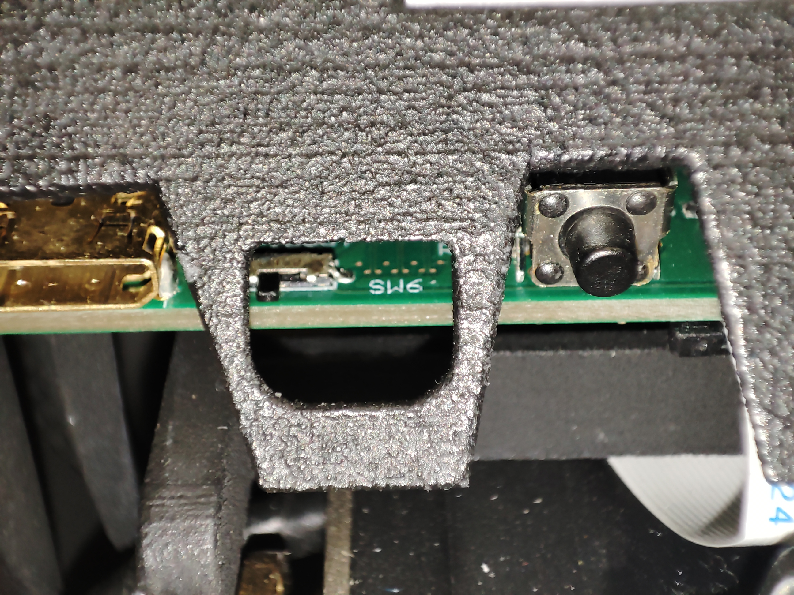

3. Подключите устройство к внешнему ПК при помощи *USB-C* кабеля.

4. Включите устройство

## 2.1 Запуск загрузчика (Ubuntu)

Установите утилиту *usbboot* и запустите её:

```bash
sudo apt install rpiboot
sudo rpiboot
```

Установите программу **rpi-imager** и запустите её:

```bash
sudo apt install rpi-imager
rpi-imager
```

### Отладка

Приведем решения некоторых проблем, которые могут возникать при запуске загрузчика через *Ubuntu*.

Возможна ситуация, при которой текущий пользователь не имеет прав доступа к внешним устройствам. Выдать права можно командой


```bash
sudo adduser <ИМЯ_ПОЛЬЗОВАТЕЛЯ> dialout
```

Мы также сталкивались с ситуациями, при которых утилита *usbboot* некорректно устанавливалась из репозиториев *APT*. В таком случае помогала сборка утилиты из исходного кода:

```bash
sudo apt install git libusb-1.0-0-dev pkg-config build-essential
git clone --recurse-submodules --shallow-submodules --depth=1 https://github.com/raspberrypi/usbboot
cd usbboot
make
sudo make install
sudo rpiboot
```

## 2.2 Запуск загрузчика (Windows)

1. Скачайте установщик утилиты *usbboot* по [ссылке](https://github.com/raspberrypi/usbboot/raw/master/win32/rpiboot_setup.exe) и запустите его.

4. Скачайте установщик программы *rpi-imager* по [ссылке](https://downloads.raspberrypi.org/imager/imager_latest.exe) и запустите его.

2. Перезагрузите ПК

3. Запустите программу *rpiboot-CM4-CM5 - Mass Storage Gadget* из меню "Пуск":

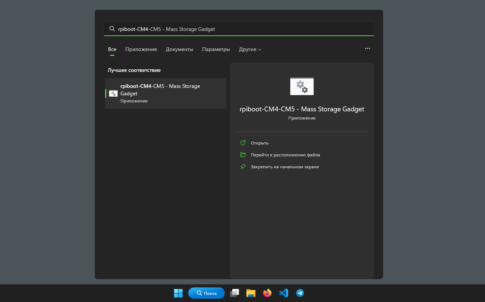

4. Запустите программу RPI-Imager из меню "Пуск":

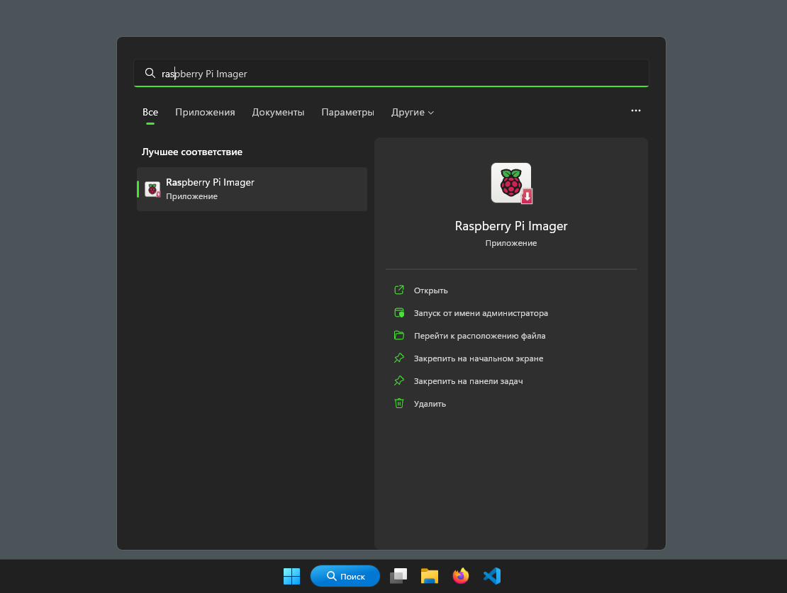

## 3. Установка образа из RPi-Imager

После выполнения шагов п.2 должно открыться окно *RPi-Imager*.

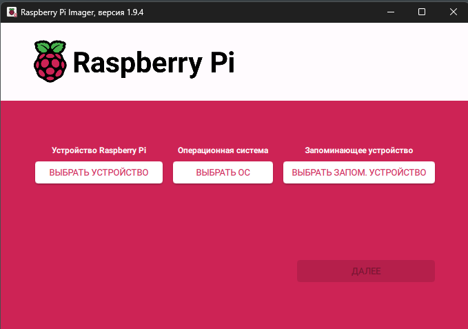

1. Нажмите кнопку *ВЫБРАТЬ УСТРОЙСТВО* (*CHOOSE DEVICE*). В предложенном окне выберите опцию *No Filtering*.

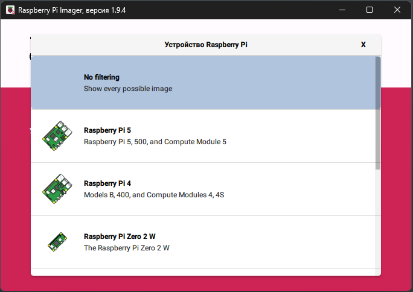

2. Нажмите кнопку *ВЫБРАТЬ ОС* (*CHOOSE OS*). В предложенном окне выберите опцию *Использовать настраиваемый образ*. В предложенном окне выберите файл образа. "Сырой" образ имеет расширение *.img*, также поддерживаются образы, запакованные в zip-архив.

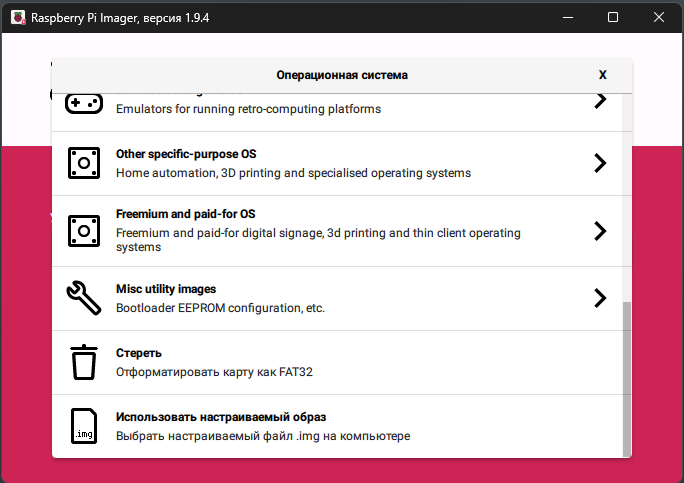

3. Нажмите кнопку *ВЫБРАТЬ ЗАПОМ. УСТРОЙСТВО* (*CHOOSE STORAGE*). При условии того, что все шаги из п.2 выполнены успешно, в предложенном окне должно появится устройство с названием *RPI-MSD-xxxx*. Выберите данное устройство.

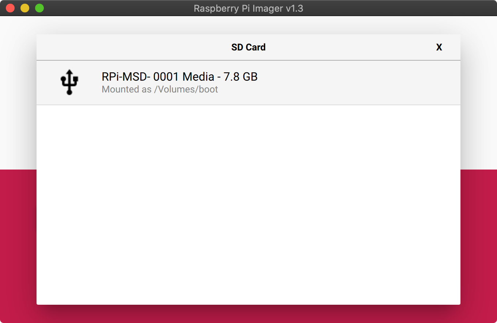

4. Нажмите кнопку *ДАЛЕЕ*. В предложенном окне нажмите кнопку *НЕТ*, чтобы пропустить кастомизацию образа.

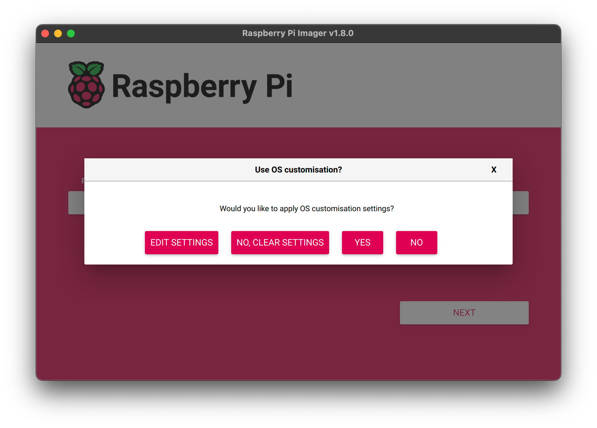

5. В предложенном окне подтвердите начало загрузки. Введите пароль, если программа этого потребует.

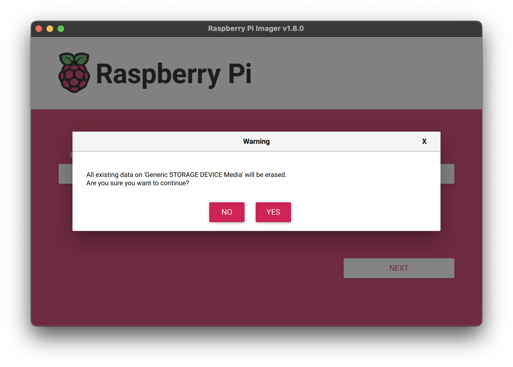

6. После выполнения данных шагов должна начаться загрузка образа. Этот процесс занимает некоторое время (30-45 минут). После завершения должно появится следующее сообщение:

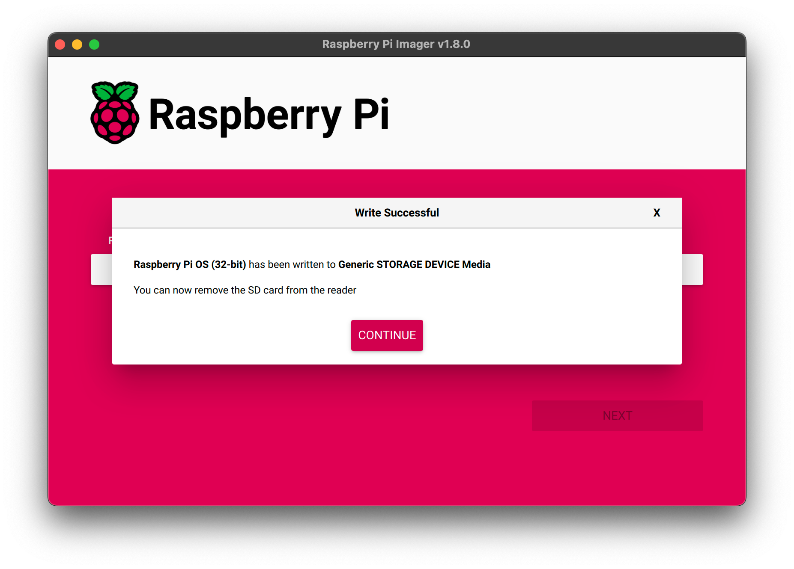

Выключите питание и отключите usb-кабель от устройства. Переведите тумблер из п.1 в правое положение.

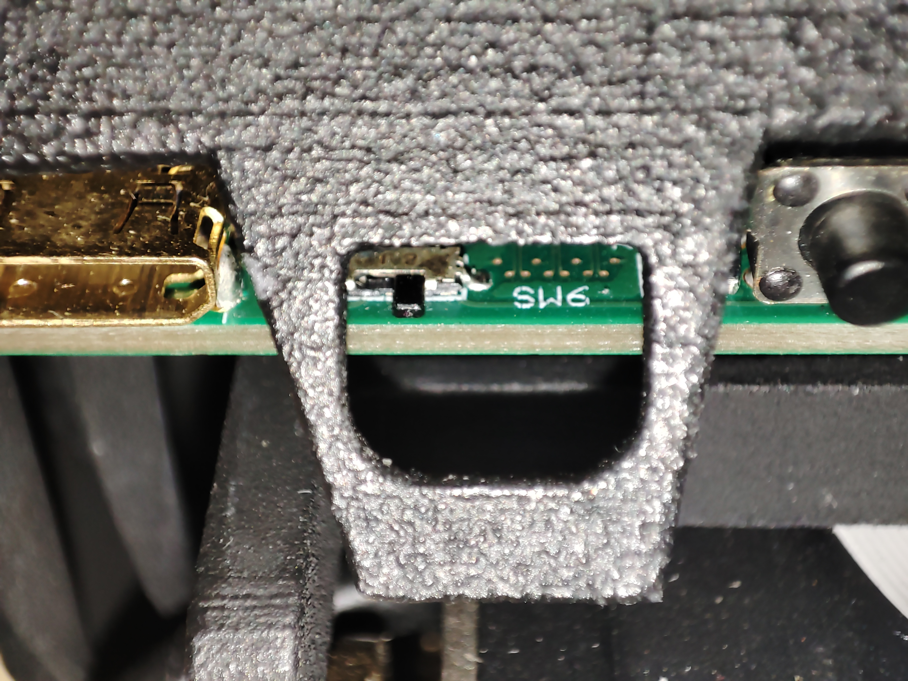

Включите устройство и дождитесь запуска ОС. Первоначальный запуск после переустановки образа занимает 3-4 минуты.
