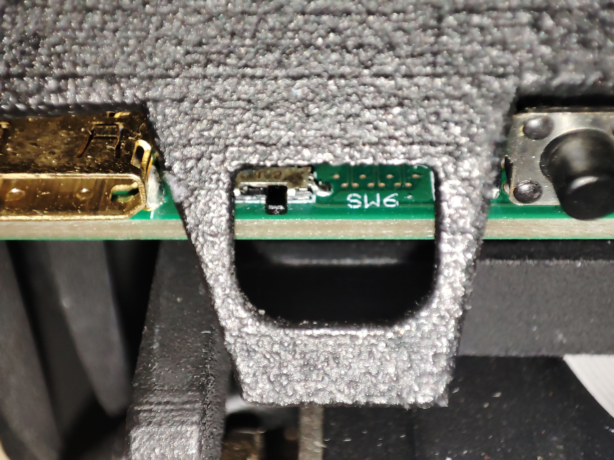

# Начало работы

Данная статья посвящена тому, как начать работу с "Головой Робота".


## 0. Подключение питания

Подсоедините штатный блок питания к разьему на задней стороне постамента. Удостоверьтесь в том, что провод, идущий из постамента, подключен к "затылку" головы.


Удостоверьтесь в том, что тумблер на "затылке" головы поставлен в правое положение. Если это не так, выключите питание и передвиньте его направо.



Проверьте, что питание подключилось: кнопка на передней части постамента должна гореть, будучи выставленной в верхнее положение.


Дальнейшие шаги будут посвящены трем вариантам подключения к "Голове робота".

## 1. Подключение напрямую

Данный вариант позволяет подключиться к RPi как к обычному ПК с клавиатурой, мышью, и HDMI-выходом на дисплей.

#### Что потребуется:
- Клавиатура, мышь
- Кабель Mini HDMI - HDMI
- Внешний монитор
- USB-концентратор 

#### Схема подключения

Первым делом, необходимо отключить питание от устройства.

Подключаем USB концентратор к type-С входу на затылке головы. В данном примере используется концентратор с type-C выходом. Вариант использования type-C -> type-A переходника в комбинации с type-A концентратором тоже будет работать.


Подключаем клавиатуру и мышь в концентратор.

Далее небходимо подключить внешний дисплей к Mini HDMI разъему на затылке робота.


Наконец, включите питание устройства. Через некоторое время на экране дисплея должен отобразиться рабочий стол операционной системы. Проверьте, что клавиатура и мышь работают.


## 2. Подключение через VNC: WiFi

Данный вариант является самым удобным, поскольку после настройки он не требует проводов для подключения. Однако, для первоначальной настройки потребуется повторить действия из предыдущего пункта.

### Что потребуется
- Выполненный п.1
- Внешний ПК
- Доступ к WiFi

### Конфигурация

Для начала, необходимо установить на внешний ПК программу для подключения к удаленному столу по протоколу VNC, например, [RealVNC Viewer](www.realvnc.com/en/connect/download/viewer/).

Затем нужно подключить "Голову Робота" к той же сети WiFi, в который находится используемый внешний ПК.

Для этого нужно открыть сетевую панель на верхней правой части рабочего стола "Головы Робота".


После нажатия на указанную иконку откроется список доступных WiFi сетей. В нем необходимо выбрать Вашу сеть и подключиться к ней, по необходимости введя пароль.


После подключения иконка сетевой панели поменяется на значок WiFi. При наведении на нее отобразится IP-адрес робота в текущей сети. Также этот адрес будет отображаться мелким шрифтом в нижней части дисплея на "лице", под "улыбкой".

> Данный адрес необходимо запомнить.


> Также рекомендуем выставить роботу статический IP-адрес на вашем маршрутизаторе, чтобы при повторном подключении IP-адрес робота оставался неизменным.

Далее открываем приложение *VNC Viewer* на внешнем ПК.

> При первом подключении RealVNC предлагает зарегистрироваться, однако этого можно не делать, если найти мелкую серую кнопку внизу.

При открытии *VNCViewer* откроется, в верхней части которого находится текстовое поле. В него необходим ввести ранее полученный IP-адрес робота, и затем нажать Enter.


Далее высветится предупреждение, которое необходимо проигнорировать, нажав кнопку *Continue*


После этого откроется окно, запрашивающее логин и пароль. В нем необходимо ввести логин ```pi``` и пароль ```raspberry```, и затем нажать кнопку *ОК*. При желании, можно выставить галочку в поле *Remember password*, чтобы не вводить данные при каждом подключении.


После этого, перед вами откроется удаленный рабочий стол, которым можно управлять с внешнего ПК.


# 3. Подключение через VNC: Ethernet

Данный вариант работает аналогично предыдущего за тем исключением, что вместо подключения по WiFi используется подключение по Ethernet. Как и в предыдущем варианте, для первичной конфигурации необходимо физически подключить RPi к внешнему дисплею, клавиатуре и мыши.

### Что понадобится
- Выполненный п.1
- Кабель RJ45 -> IX (идет в комплекте)
- Внешний ПК с сетевой картой

### Схема подключения

Для начала, необходимо соединить ПК и "Голову Робота" при помощи кабеля.


Штекер IX соединяется с гнездом, находящийся под откидной крышкой на "макушке"


Другой конец кабеля имеет коннектор RJ45, то есть самый обычный Ethernet-коннектор. Он подключается к сетевой внешнего ПК.

### Конфигурация

Далее на внешнем ПК необходимо отредактировать настройки для проводного соединения. Алгоритм зависит от операционной системы и версии устройства, однако он сводится к такой последовательности действий:

1. Открыть настройки проводного соединения на внешнем ПК.
2. Проверить, что интерфейс имеет IPv4-адрес ```100.0.0.x```, где ```1 < x < 255```. Маска подсети должна быть ```255.255.255.0```.
3. Если это не так, установить интерфейсу статический IPv4 адрес из этого диапазона, а также указанную маску подсети.

Далее необходимо повторить шаги из п.2, подключаясь через VNC по адресу ```100.0.0.1```.

> Ethernet-интерфейс устройства имеет статический IPv4 адрес ```100.0.0.1/24```. На новых версиях "Головы" Raspbery Pi также является DHCP-сервером, то есть она способна автоматически выдавать IP-адреса подключенным к ней устройствам. На более старых версиях конфигурацию приходится проводить вручную.
